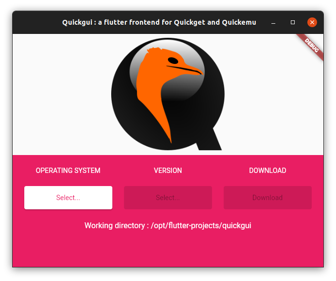
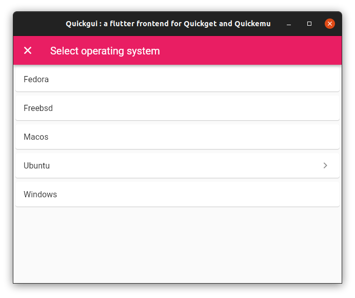
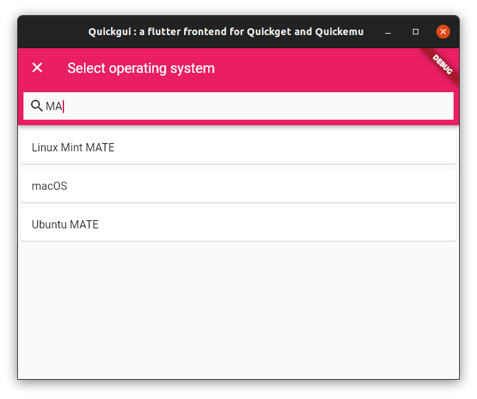
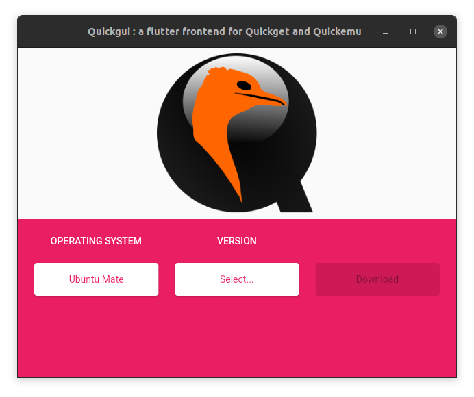
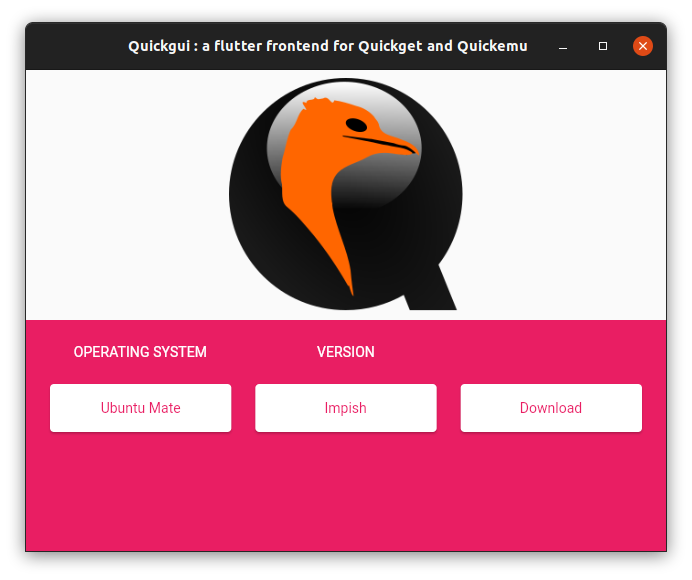
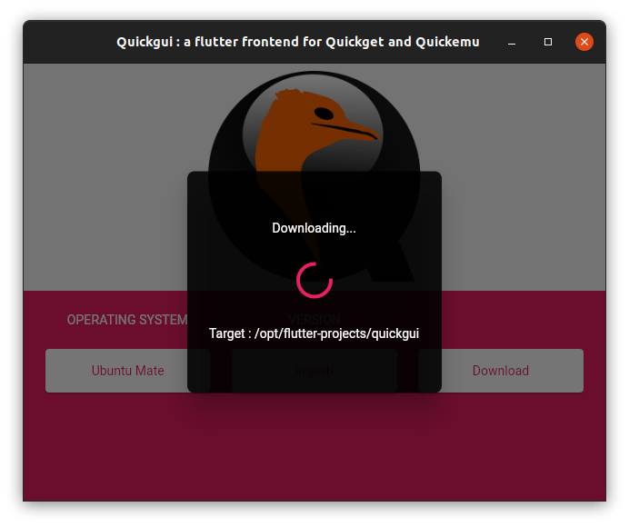

# Guickgui

A new Flutter frontend for Quickget.

## Build


* [Set up Flutter](https://ubuntu.com/blog/getting-started-with-flutter-on-ubuntu)
* Clone this repo,
* Switch to the project's directory,
* Build the project.

```bash
$ git clone https://github.com/ymauray/quickgui.git
$ cd quickgui
$ flutter build linux --release
```

## Run

* From the project's folder, start the binary with : 
```
$ ./build/linux/x64/release/bundle/quickgui
```

Alternativelly, use `update-alternatives` to install `quickgui` system-wide :

```bash
sudo update-alternatives --install /usr/local/bin/quickgui quickgui /opt/flutter-projects/quickgui/build/linux/x64/release/bundle/quickgui 50
```

## Usage

From the main screen, select the operating system you want to use :








Then, select the version :




Then click "Download". The ISO will be downloaded in the current working directory, in 99% of cases that will be the directory where `quickgui` was invoked from. The spinner will tell you where the file is being downloaded.





