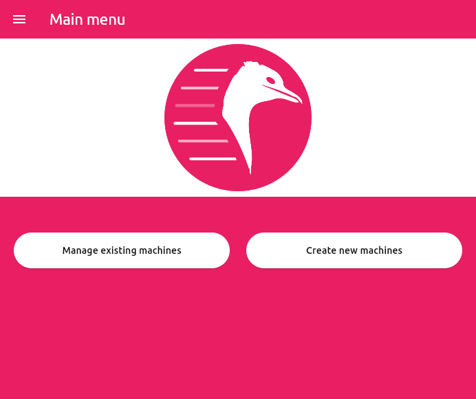
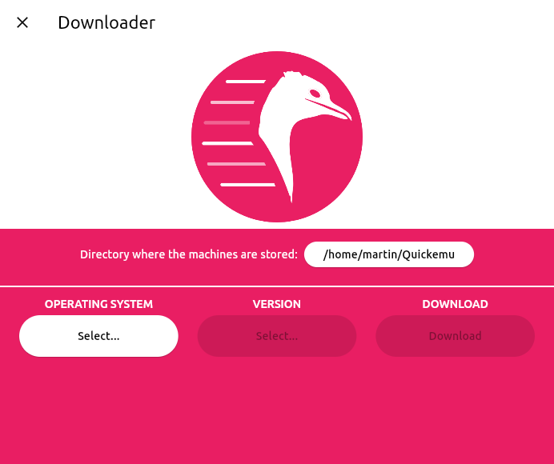
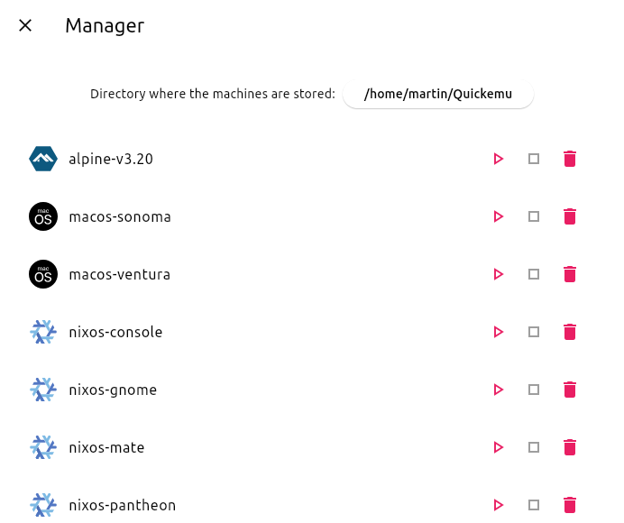

<div align="center">


# Quickgui

**An elegant virtual machine manager for the desktop**

**Made with 💝 for **
<!--& -->
</div>


<p align="center">
  &nbsp;<a href="https://wimpysworld.io/discord" target="_blank"></a>
</p>

# Introduction

Quickgui is a graphical user interface for the [Quickemu](https://github.com/quickemu-project/quickemu) virtual machine manager.
Quickgui enables you to create and manage virtual machines from a simple and elegant interface.
Nearly 1000 operating systems supported including Windows, macOS, BSDs, and 100s of Linux distros. All with automated downloads and configuration.

# Install

Quickgui depends on Quickemu. Most package managers will automatically install Quickemu when you install Quickgui.

If you don't have Quickemu installed then go and follow the Quickemu installation steps for your operating system:

- [**Quickemu Installation**](https://github.com/quickemu-project/quickemu/wiki/01-Installation)

## Debian

A .deb package is available for Debian on our [release page](https://github.com/quickemu-project/quickgui/releases).

- Download the latest .deb package
- Install it with `apt-get install ./quickgui-1.2.10+1-linux.deb`

## Fedora

A .rpm package is available for Fedora on our [release page](https://github.com/quickemu-project/quickgui/releases).

## NixOS

### Flake

[](https://flakehub.com/flake/quickemu-project/quickgui)

Stable releases of Quickgui are published to FlakeHub for NixOS users. See the Quickemu flake on FlakeHub for more details:

- <https://flakehub.com/flake/quickemu-project/quickgui>

### Nixpkgs

Add Quickgui to your `systemPackages`. For example:

```nix
systemPackages = with pkgs; [
  quickgui
];
```

## Ubuntu

Ubuntu users can install Quickgui using the [.deb package described above for Debian](#debian) or from our PPA.

```shell
sudo add-apt-repository ppa:flexiondotorg/quickgui
sudo apt-get update
sudo apt-get install quickgui
```

## Other Linux

We provide an AppImage and a pre-compiled binary of Quickemu in a .zip file.

### AppImage

The AppImage should work on most Linux distributions.

* [Download](https://github.com/quickemu-project/quickgui/releases) the latest AppImage.
* `chmod +x quickgui-1.2.10+1-linux.AppImage`
* `./quickgui-1.2.10+1-linux.AppImage`

### Pre-compiled binary

* [Download](https://github.com/quickemu-project/quickgui/releases) the latest .zip file.
* `unzip quickgui-1.2.10+1-linux.zip`
* `cd quickgui-1.2.10+1-linux`
* `chmod +x quickgui`
* `./quickgui`

# Compile

To compile the Quickgui yourself:

* [Install Flutter](https://docs.flutter.dev/get-started/install/linux/desktop)
* `git clone https://github.com/quickemu-project/quickgui.git`
* `cd quickgui`
* `flutter pub get`
* `flutter config --enable-linux-desktop`
* `flutter build linux --release`

The compiled binary will be in `build/linux/x64/release/bundle/quickgui`.
You can run it with:

```shell
./build/linux/x64/release/bundle/quickgui
```

# Usage

<div align="center">
<small><b>Main Screen</b></small><br /><br />

</div>

## Downloader

- From the main screen, click "Create new machines"
- Select the Operating System you want to install
- Select the Version of the operating system you want to use.
- Click the "Download" button.
  - The ISO will be downloaded
- When the download is complete, click the "Dismiss" button.

<div align="center">
<small><b>Downloader</b></small><br />

</div>

## Manager

- From the main screen, click "Manage existing machines"
- The Manager screen will list available Quickemu VMs in the directory you have chosen to store them.
- Start a VM by clicking the "Play" (▶) button.
- Kill a running VM by clicking the "Stop" (■) button.
- Clicking the "Trash" (🗑) button will prompt you to delete the whole VM or just its disk image.

<div align="center">
<small><b>Manager</b></small><br />

</div>

When a VM is running, Quickgui will display the host ports that are mapped to the SPICE and SSH ports on the guest. These ports are used to connect to the guest for display and SSH access.

### SPICE

If you close the SPICE display and wish to reconnect, you can click the "Connect display with SPICE" button. To open an SSH session, you can click the "Connect with SSH" button.

If the "Connect display with SPICE" button is disabled, the `spicy` client cannot be found. Ensure it is installed, and in your PATH (it should have been installed with `quickemu`).

### SSH

If the "Connect with SSH" button is disabled, an SSH server cannot be detected on the guest. Most guest operating systems will not install an SSH server by default, so if it was not an option during installation, you will need to install one yourself. It must be listening on port 22 (the default SSH port). Once a server is installed and running, it should be detected automatically.

"Connect with SSH" will open a terminal and attempt to connect to the guest. If the connection is successful, you will be prompted for the password. If the connection is unsuccessful, you might need to remove the host key for the guest from your `~/.ssh/known_hosts` file using something like `ssh-keygen -R [localhost]:22220`.
