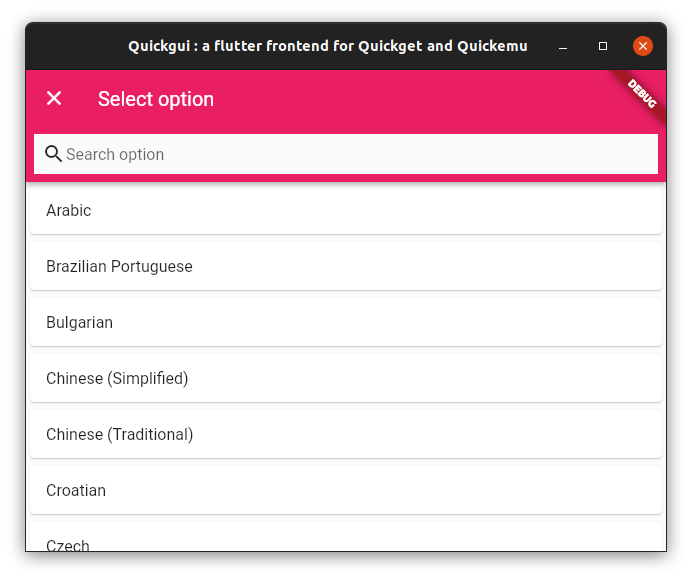
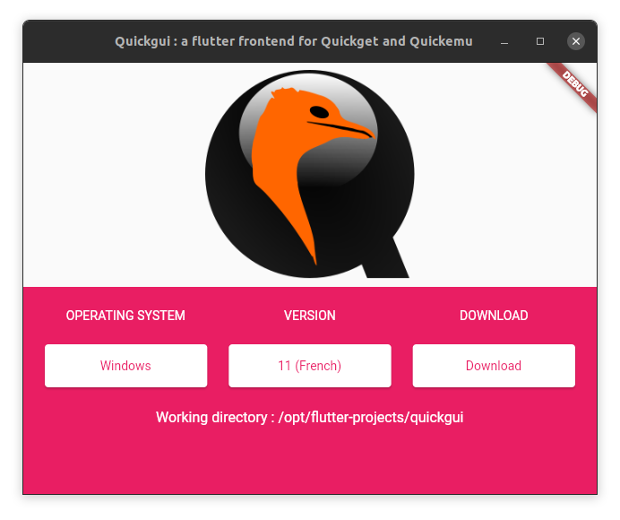
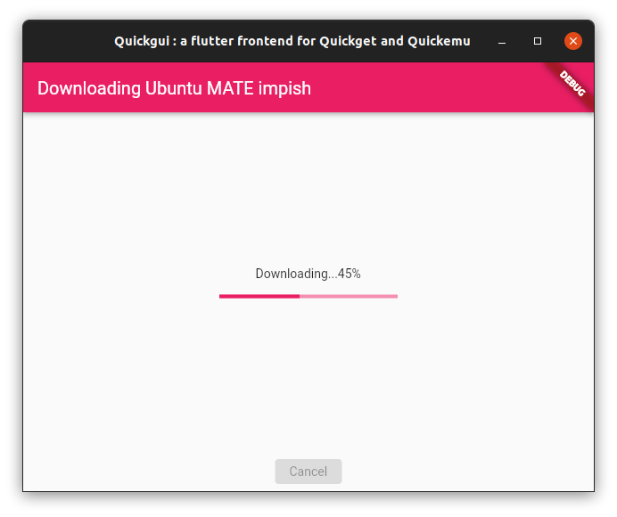
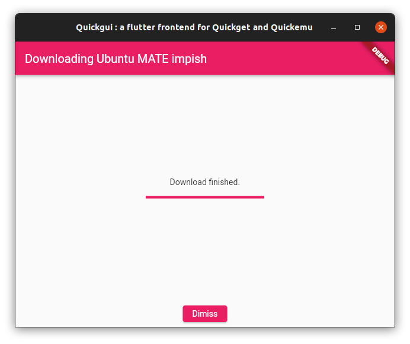

<h1 align="center">
  
  <br />
  Quickgui
</h1>

<p align="center">A Flutter frontend for `quickget` and [quickemu](https://github.com/wimpysworld/quickemu).</p>
<div align="center"></div>

This project is discussed mainly on [](https://discord.gg/sNmz3uw) server

## Install

### quickemu

For this tool to work, you need to have `quickget`, from the `quickemu` 
package, in your current `path`.
Go to the `quickemu` [github page](https://github.com/wimpysworld/quickemu)
for more information about installing the tool.

### Standard package

On Ubuntu, `quickgui` can be installed as a standard package.

First, add this ppa (this only needs to be done once) :

```
sudo add-apt-repository ppa:yannick-mauray/quickgui
sudo apt update
```

Then, install the pacakge : 
```
sudo apt install quickgui
```

### Pre-compiled binary

* [Download](https://github.com/quickgui/quickgui/releases/) the binary.
* Uncompress the tarball wherever you want.
* From anywhere on the filesystem, run the app.

```bash
xz quickgui-a.b.c-d.tar.xz
tar xvf quickgui-a.b.c-d.tar
/path/to/quickgui
```

Alternativelly, use `update-alternatives` to install `quickgui` system-wide :

```bash
sudo update-alternatives --install /usr/local/bin/quickgui quickgui /path/to/quickgui 50
```

## Build

If you don't want to run the binary, you can rebuild the application yourself :

* [Set up Flutter](https://ubuntu.com/blog/getting-started-with-flutter-on-ubuntu)
* Clone this repo,
* Switch to the project's directory,
* Build the project,
* Run the app.

```bash
git clone https://github.com/quickgui/quickgui.git
cd quickgui
flutter build linux --release
./build/linux/x64/release/bundle/quickgui
```

You can also use `update-alternatives` for easier access to the app.

## Usage

### Downloading VMs

From the main screen, select the operating system you want to use. The list can be filtered.


<div align="center"></div>

<div align="center"></div>

<div align="center"></div>

Then, select the version :

<div align="center"></div>

<div align="center"></div>

If there are some options (Windows language, Pop!_OS nvidia or Intel, etc..), they will be displayed :

<div align="center"></div>

<div align="center"></div>

Then click "Download". The ISO will be downloaded in the current working directory, in 99% of cases that will be the directory where `quickgui` was invoked from.

<div align="center"></div>

<div align="center"></div>

<div align="center"></div>

### Managing VMs

The "Manage running VMs" screen will list available Quickemu VMs in the current working directory.

VMs can be launched by clicking the "Play" (▶) button. Running VMs will have the "Play" and "Stop" buttons highlighted in green and red respectively, and pressing "Stop" (■) will kill the running VM.

When a VM is running, the host's ports mapped to SPICE and SSH on the guest will be displayed. If you close the SPICE display and wish to reconnect, you can click the "Connect display with SPICE" button. To open an SSH session, you can click the "Connect with SSH" button.

If the "Connect display with SPICE" button is disabled, the `spicy` client could not be found. Ensure it is installed, and in your PATH (it should have been installed with `quickemu`)

If the "Connect with SSH" button is disabled, an SSH server could not be detected on the guest. Most guest operating systems will not install an SSH server by default, so if it was not an option during install, you will need to install one yourself. It must be listening on port 22 (the default SSH port). Once a server is installed and running, it should be detected automatically.

"Connect with SSH" will use the terminal emulator symlinked to `x-terminal-emulator`. Several common terminal emulators are supported. If yours is not, please raise an issue on this repository.
